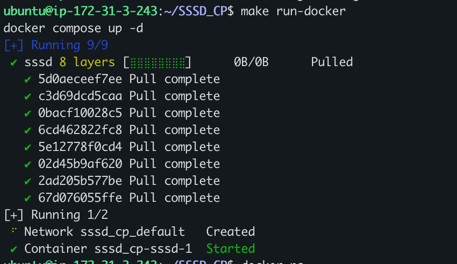
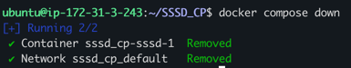
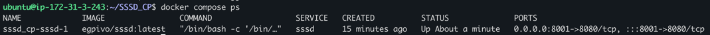
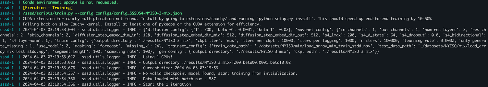
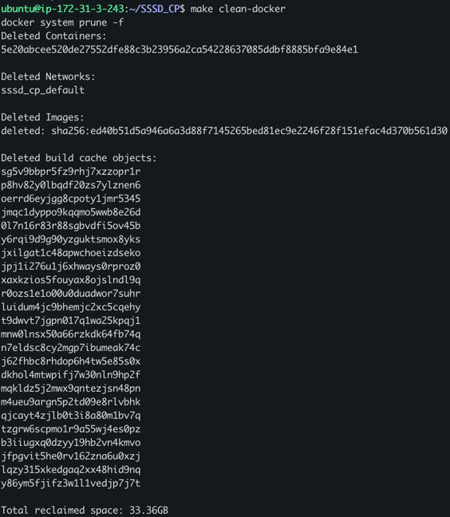

# SSSD
<p align="left">
  <a href="https://github.com/egpivo/SSSD_CP/actions"></a>
  <a href="https://codecov.io/gh/egpivo/SSSD_CP"></a>
  <a href="https://hub.docker.com/repository/docker/egpivo/sssd"></a>
  <a href="https://hub.docker.com/repository/docker/egpivo/sssd"></a>
</p>

## Prerequisites
- [Local Environment] [Install Miniconda](https://docs.anaconda.com/free/miniconda/miniconda-install/)
- [Docker] [Install Docker](https://docs.docker.com/get-docker/)


## Dataset
1. The NYISO dataset can be downloaded from [here](https://www.nyiso.com/).
2. The cleaned data created by the author can be downloaded from [this link](https://drive.google.com/drive/folders/1dwPkBIHSikhQ5ru3HPQiILSnaGAtP3Yr?usp=sharing).

   Note that the cleaned data is created following the scripts in `notebooks/dataset_script/nyiso-csv-to-pickle.ipynb` and `notebooks/dataset_script/nyiso-load-pickle-to-npy.ipynb`.

## Usage
0. Download data from `google drive` or `S3` to `datasets/`
   - `S3`:
     - Enter the AWS credentials
     - Enter`aws s3 sync s3://sssd-cp/datasets/ /{repo}/datasets`
1. Run the process locally:
    ```shell
    bash scripts/diffusion_process.sh --config {CONFIG_FILE_PATH}
    ```
   - Example: `CONFIG_FILE_PATH=configs/config_toy_example.json`

2. Run in a container:
   - Adjust `CONFIG_FILE` in `docker-compose.yaml`
   - Trigger
       ```shell
       make run-docker
       ```
     

####  Useful Commands

1. Stopping Docker Container: To stop the Docker container,
    ```bash
    docker compose down
    ```
   
2. Check a Docker container status
   ```bash
   docker compose ps
   ```
   
3. Check a Docker container logs
   ```bash
   docker compose logs
   ```
   

4. Clean Docker cache
   ```bash
   docker system prune -f
   ```
   

## Suggestions
1. Use `CUDA_VISIBLE_DEVICES` to specify the number of GPUs. Both training and inference require the same number of GPUs.
2. Use the sample size as the parameter --num_samples in the inference section.
   - Example:
        ```bash
        python sssd/infer.py -c configs/config_SSSDS4-NYISO-3-mix.json --num_samples=128
        ``````
