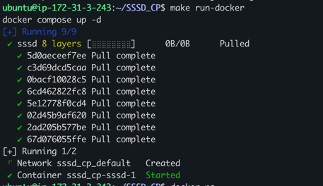

# SSSD
<p align="left">
  <a href="https://github.com/egpivo/SSSD_CP/actions"></a>
  <a href="https://codecov.io/gh/egpivo/SSSD_CP"></a>
  <a href="https://hub.docker.com/repository/docker/egpivo/sssd"></a>
  <a href="https://hub.docker.com/repository/docker/egpivo/sssd"></a>
</p>

## Prerequisites
- [Local Environment] [Install Miniconda](https://docs.anaconda.com/free/miniconda/miniconda-install/)
- [Docker] [Install Docker](https://docs.docker.com/get-docker/)


## Dataset
1. The NYISO dataset can be downloaded from [here](https://www.nyiso.com/) but may require access from a US IP address.
2. The cleaned data created by the author can be downloaded from [this link](https://drive.google.com/drive/folders/1dwPkBIHSikhQ5ru3HPQiILSnaGAtP3Yr?usp=sharing).

   Note that the cleaned data is created following the scripts in `notebooks/dataset_script/nyiso-csv-to-pickle.ipynb` and `notebooks/dataset_script/nyiso-load-pickle-to-npy.ipynb`.

## Usage
0. Download data from `google drive` or `S3` to `datasets/`
   - `S3`:
     - Enter the AWS credentials
     - Enter`aws s3 sync s3://sssd-cp/datasets/ /{repo}/datasets`
1. Run the process locally:
    ```shell
    bash scripts/diffusion/diffusion_process.sh \
      --model_config {MODEL_CONFIG} \
      --training_config {TRAINING_CONFIG} \
      --inference_config {INFERENCE_CONFIG}
    ```
   - Note: Modify the parameters in three different configs. If the training or inference config is empty, the process will not be executed.

2. Run in a container:
   - Adjust `CONFIG_FILE` in `docker-compose.yaml`
   - Trigger
       ```shell
       make run-docker
       ```
     

- Multi-GPU progressing
  1. Docker: Modify `device_ids` in `docker-compose.yaml`
  2. Local: Specify the number of GPUs to the environment variable `CUDA_VISIBLE_DEVICES` to

## Documentation
- [Configuration](configs/README.md)
- [Docker Common Usage](envs/docker/README.md)

## References
- Alcaraz and Strodthoff (2023). [Diffusion-based Time Series Imputation and Forecasting with Structured State Space Models](https://arxiv.org/pdf/2208.09399.pdf)
  - Repo: https://github.com/AI4HealthUOL/SSSD
